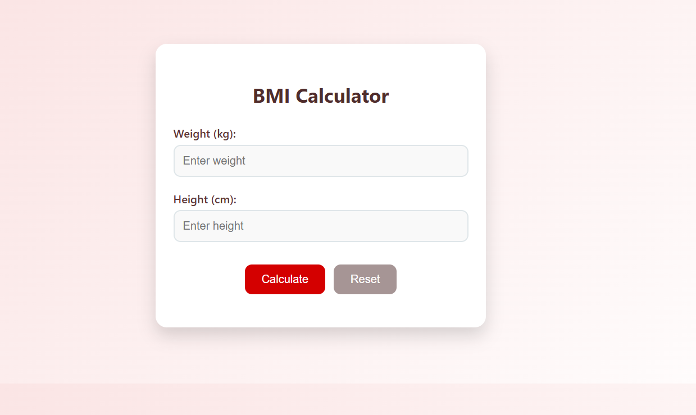
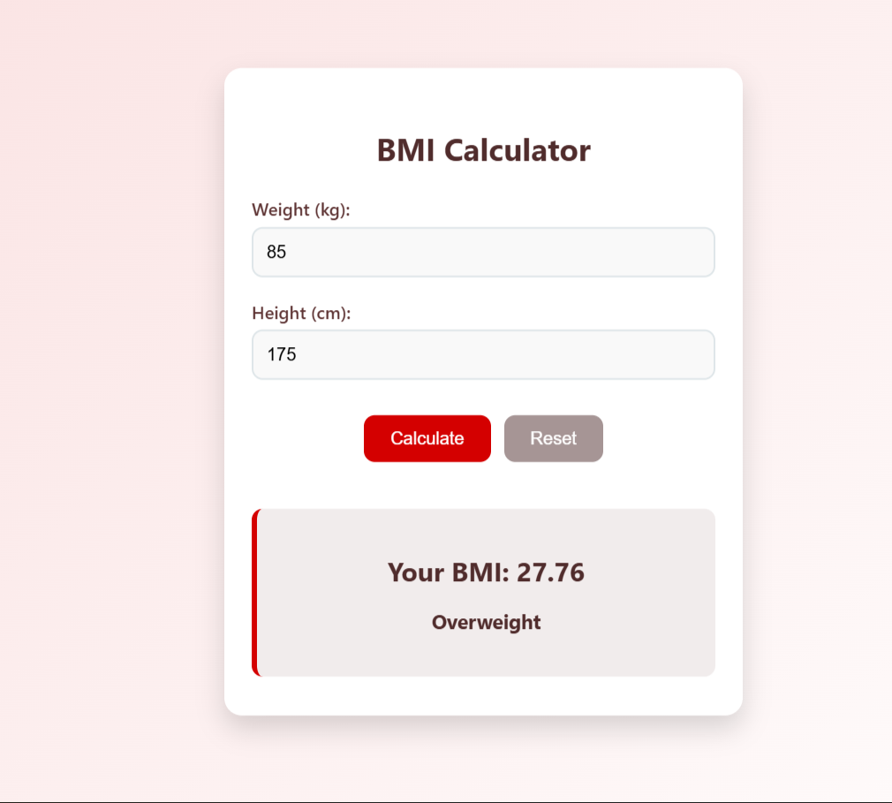

# Ex06 BMI Calculator
## Date: 13-11-2025

## AIM
To create a BMI calculator using React Router 

## ALGORITHM
### STEP 1 State Initialization
Manage the current page (Home or Calculator) using React Router.

### STEP 2 User Input
Accept weight and height inputs from the user.

### STEP 3 BMI Calculation
Calculate the BMI based on user input.

### STEP 4 Categorization
Classify the BMI result into categories (Underweight, Normal weight, Overweight, Obesity).

### STEP 5 Navigation
Navigate between pages using React Router.

## PROGRAM
App.jsx

```
import React, { useState } from 'react';
import './App.css';

function App() {
  const [weight, setWeight] = useState('');
  const [height, setHeight] = useState('');
  const [bmi, setBmi] = useState(null);
  const [message, setMessage] = useState('');

  const calculateBMI = () => {
    if (weight && height) {
      const heightInMeters = height / 100;
      const calculatedBMI = (weight / (heightInMeters * heightInMeters)).toFixed(2);
      setBmi(calculatedBMI);
      getBMICategory(calculatedBMI);
    } else {
      alert('Please enter valid height and weight.');
    }
  };

  const getBMICategory = (bmi) => {
    if (bmi < 18.5) setMessage('Underweight');
    else if (bmi >= 18.5 && bmi < 24.9) setMessage('Normal weight');
    else if (bmi >= 25 && bmi < 29.9) setMessage('Overweight');
    else setMessage('Obese');
  };

  const resetFields = () => {
    setWeight('');
    setHeight('');
    setBmi(null);
    setMessage('');
  };

  return (
    <div className="container">
      <h1>BMI Calculator</h1>
      <div className="input-group">
        <label>Weight (kg):</label>
        <input
          type="number"
          value={weight}
          onChange={(e) => setWeight(e.target.value)}
          placeholder="Enter weight"
        />
      </div>
      <div className="input-group">
        <label>Height (cm):</label>
        <input
          type="number"
          value={height}
          onChange={(e) => setHeight(e.target.value)}
          placeholder="Enter height"
        />
      </div>
      <button onClick={calculateBMI}>Calculate</button>
      <button className="reset" onClick={resetFields}>Reset</button>
      
      {bmi && (
        <div className="result">
          <h2>Your BMI: {bmi}</h2>
          <p className="message">{message}</p>
        </div>
      
      )}
    </div>
  );
}

export default App;

```

App.css

```
body {
  font-family: 'Segoe UI', Tahoma, Geneva, Verdana, sans-serif;
  background: linear-gradient(135deg, #fae0e0, #ffffff);
  margin: 0;
  padding: 0;
}

.container {
  max-width: 420px;
  margin: 80px auto;
  padding: 35px 25px;
  background-color: #ffffff;
  border-radius: 16px;
  box-shadow: 0 12px 24px rgba(0, 0, 0, 0.15);
  text-align: center;
  transition: transform 0.2s ease-in-out;
}

.container:hover {
  transform: translateY(-5px);
}

h1 {
  margin-bottom: 25px;
  font-size: 28px;
  color: #502c2c;
}

.input-group {
  margin-bottom: 20px;
  text-align: left;
}

.input-group label {
  display: block;
  margin-bottom: 6px;
  font-weight: 600;
  color: #5e3434;
}

.input-group input {
  width: 100%;
  padding: 12px;
  font-size: 16px;
  border: 2px solid #dfe6e9;
  border-radius: 10px;
  background-color: #f9f9f9;
  outline: none;
  transition: border-color 0.3s;
  box-sizing: border-box;
}

.input-group input:focus {
  border-color: #d40000;
}

button {
  padding: 12px 24px;
  font-size: 16px;
  margin: 12px 6px;
  border: none;
  border-radius: 10px;
  cursor: pointer;
  background-color: #d40000;
  color: white;
  transition: background-color 0.3s ease, transform 0.2s ease;
}

button:hover {
  background-color: #a70000;
  transform: scale(1.05);
}

button.reset {
  background-color: #a69595;
}

button.reset:hover {
  background-color: #8d7f7f;
}

.result {
  margin-top: 30px;
  padding: 20px;
  border-radius: 10px;
  background-color: #f1ecec;
  border-left: 5px solid #d40000;
  text-align: center;
}

.result h2 {
  margin-bottom: 10px;
  color: #502c2c;
}
.message {
  font-size: 18px;
  font-weight: bold;
  color: #502c2c;
}

footer {
  margin-top: 40px;
  font-size: 14px;
  color: #8d7f7f;
  font-weight: 500;
}


```

## OUTPUT





## RESULT
The program for creating BMI Calculator using React Router is executed successfully.
